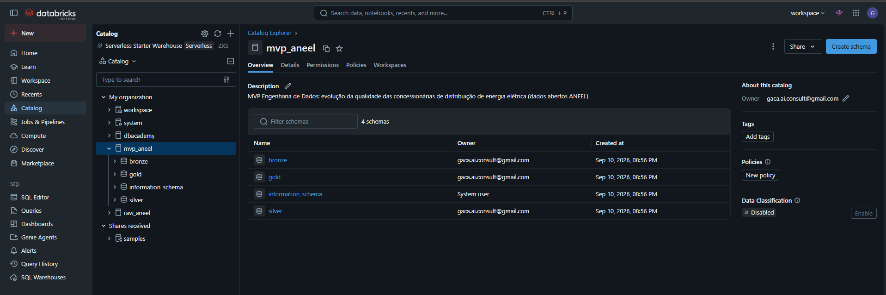
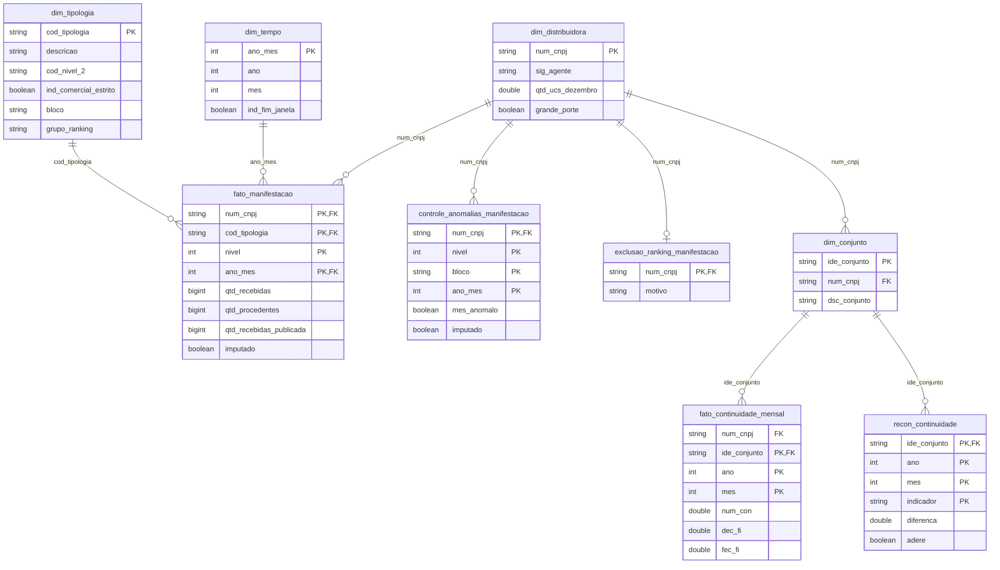
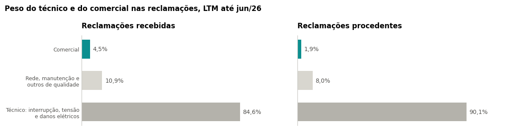
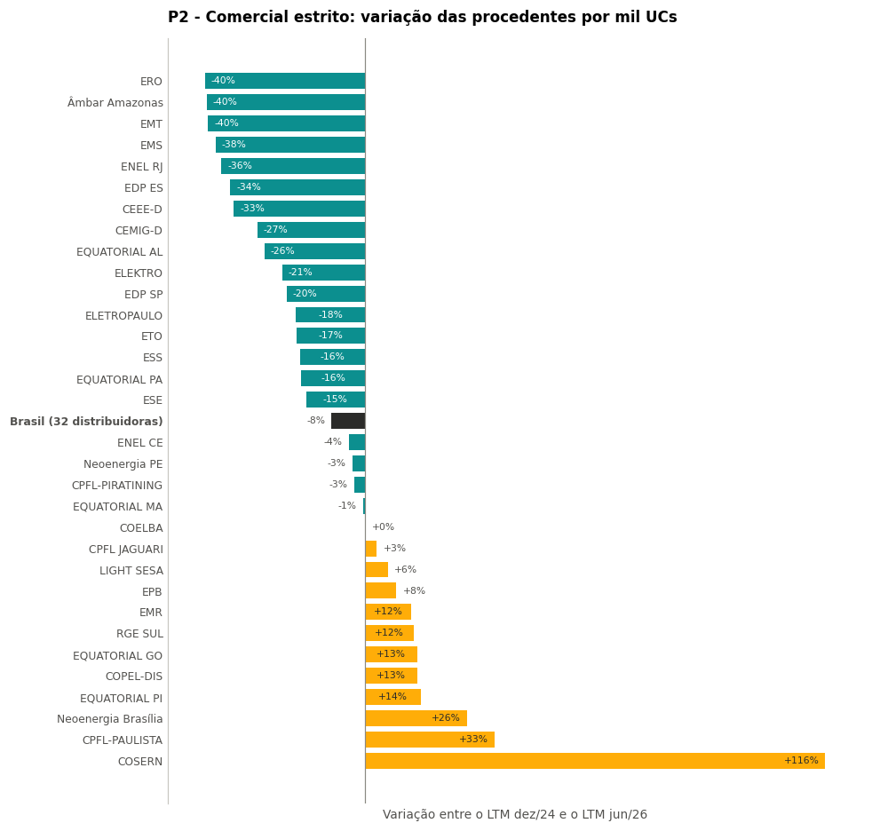
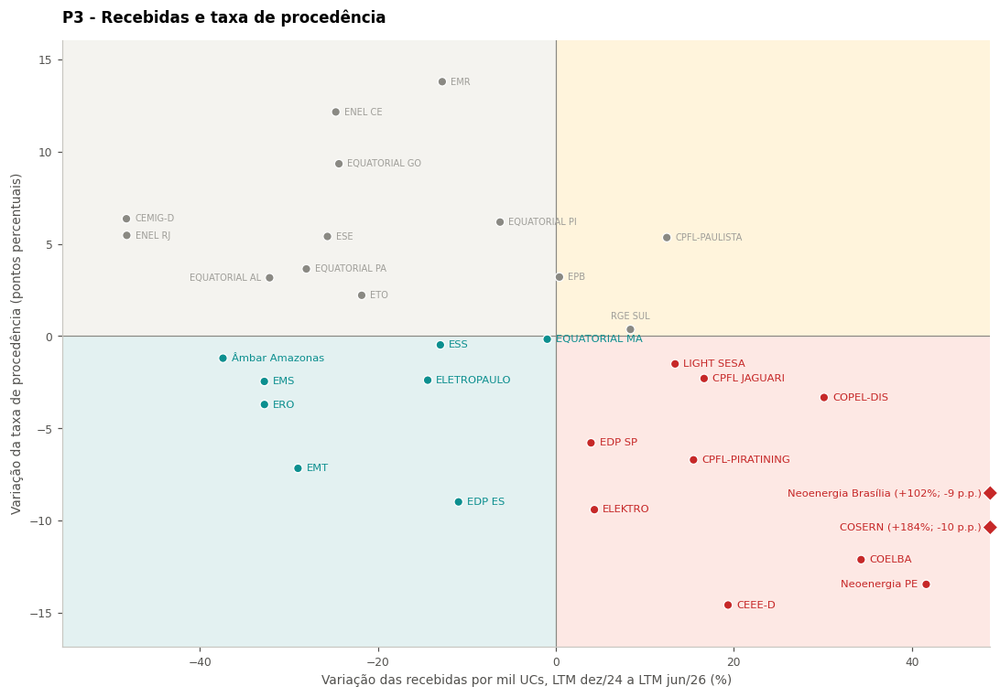
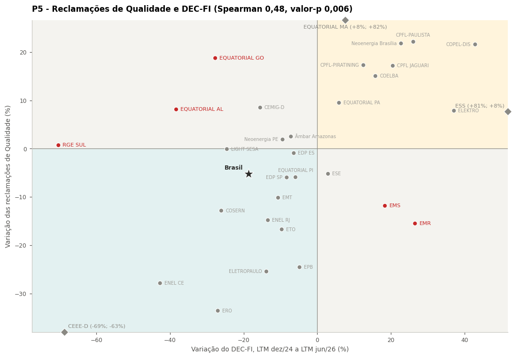
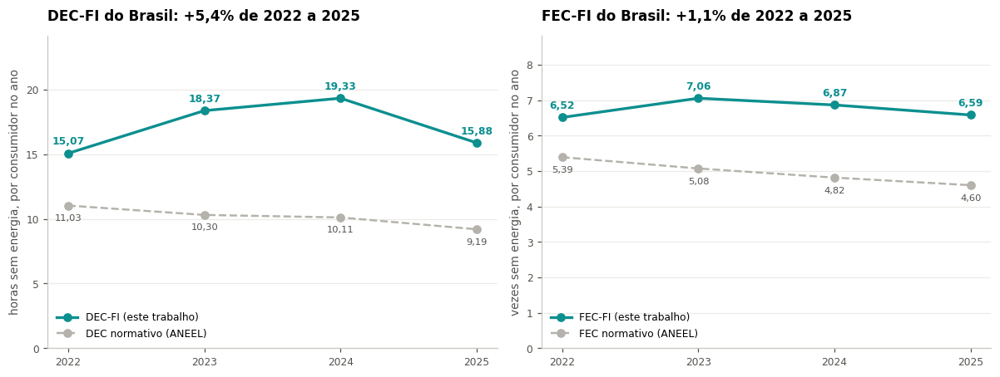
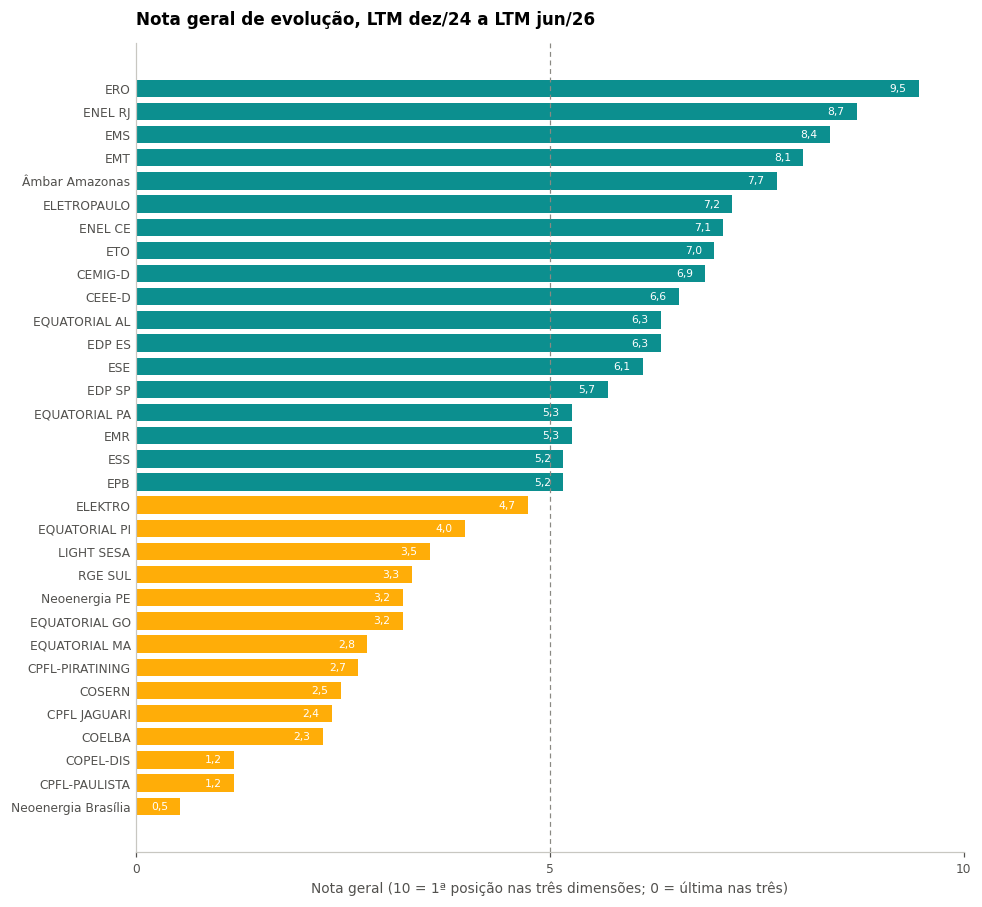

# Evolução da qualidade percebida pelo consumidor nas distribuidoras de energia de grande porte

### MVP de Engenharia de Dados · Pós-graduação em Ciência de Dados e Analytics (PUC-Rio) · Sprint 1

Pipeline na nuvem (Databricks Free Edition, arquitetura medalhão) sobre dados abertos da ANEEL (Agência Nacional de Energia Elétrica). 

### A pergunta Central: 

Entre as distribuidoras de **grande porte**, quem mais melhorou aos olhos do consumidor nos ultimos anos?

## Mapa de leitura dos notes

| Se você quer ver | Abra |
|---|---|
| O problema, as perguntas e o recorte | [`notebooks/01_objetivo.ipynb`](notebooks/01_objetivo.ipynb) |
| As respostas, com gráficos | [`03_complaints/04_analysis`](notebooks/03_complaints/04_analysis.ipynb) e [`04_continuity/03_analysis`](notebooks/04_continuity/03_analysis.ipynb) |
| O modelo de dados e o catálogo | [`docs/modelo_dados.md`](docs/modelo_dados.md) e [`docs/catalogo_dados.md`](docs/catalogo_dados.md) |
| A execução completa, com testes | Qualquer notebook em [`notebooks/`](notebooks/); todos estão salvos com as saídas |
| O registro das decisões | [`md/sessions.md`](md/sessions.md) |

---

## Contexto de Negócio e Perguntas (Etapa 2 e 4.1)

A distribuição de energia é um monopólio natural: o consumidor não escolhe a distribuidora. A qualidade é disciplinada pela regulação, e a ANEEL publica os indicadores em seu portal de dados abertos. Dezenove concessões vencem entre 2025 e 2031, e a renovação passou a depender de compromissos de qualidade, o que torna a evolução recente de cada empresa uma questão concreta.

**A escolha central é medir evolução, e não nível.** Comparar níveis entre uma área metropolitana e uma rural extensa é, em boa parte, comparar geografia. A evolução compara cada distribuidora consigo mesma.

**Perguntas respondidas.** Reclamações, comparando as janelas de 12 meses encerradas em dez/2024 e jun/2026:

| # | Pergunta |
|---|---|
| P1 | Quais grupos de reclamação comercial mais pesam para o consumidor e quais mais contribuíram para a variação? |
| P2 | Quais distribuidoras mais reduziram as reclamações comerciais recebidas e procedentes por mil UCs, e em quais grupos? |
| P3 | A redução das procedentes vem acompanhada de redução das recebidas, ou pode refletir maior rigor na classificação? |
| P4 | As reclamações técnicas e comerciais evoluem juntas em cada distribuidora? |
| P5 | O ranking de reclamações de qualidade do fornecimento confirma o ranking de continuidade? |

Continuidade, comparando 2022 e 2025: o consumidor ficou menos tempo sem energia? Quem melhorou, partindo de onde? Menos interrupções ou interrupções mais curtas? A regra de agregação do PRODIST (Procedimentos de Distribuição da ANEEL) muda o resultado?

O plano original tinha dez perguntas e seis rankings. Em 23/09 reduzi o escopo ao ranking de reclamações, com a continuidade como validação, porque:
 - o trabalho de analise de qualidade e saneamento foi maior do que o esperado
 - além da análise dos dados, foi necessário um estudo regulatório mais aprofundado para entender cada uma das métricas. Foram consultados módulos do Prodist (6 e 8), bem como a REN 1000/21 e sites da ANEEL.
 - o prazo não comportava seis métricas com a qualidade que eu gostaria de entregar. As dez perguntas continuam registradas no [`01_objetivo`](notebooks/01_objetivo.ipynb), com a situação de cada uma.

**Dados brutos.** Oito conjuntos do portal de dados abertos da ANEEL, todos sob a licença **ODbL** (Open Database License, do Open Data Commons), que permite uso, adaptação e redistribuição, com atribuição da fonte e obras derivadas sob a mesma licença. A licença de cada recurso é lida da API a cada carga e gravada na tabela de controle. Os dois conjuntos que chegam à análise:

| Conjunto | Estrutura | Linhas na Bronze |
|---|---|---:|
| Indicadores Coletivos de Continuidade | Formato longo: uma linha por conjunto de UCs, ano, mês e indicador (`SigIndicador`, `VlrIndiceEnviado`, `NumCNPJ`, `IdeConjUndConsumidoras`) | 5.108.332 |
| Manifestações no 1º e 2º nível da distribuidora | Uma linha por distribuidora, município, canal, tipologia e mês, com recebidas, procedentes e improcedentes | 29.263.282 |

Os demais (tensão, serviços comerciais, ocorrências emergenciais, investimentos) foram carregados na Bronze e ficaram fora da análise.

---

## Carga dos Dados (Etapa 4.2)

A coleta é automática, pela API CKAN do portal da ANEEL (o software de catálogo que o portal usa). O notebook resolve cada conjunto pelo seu identificador, lê a lista de arquivos e a licença, baixa os 14 arquivos para um volume do Unity Catalog (o catálogo de dados do Databricks) e registra cada um como tabela Delta na Bronze, com colunas de linhagem (`_source_file`, `_ingested_at`).

| Tabela Bronze | Linhas |
|---|---:|
| `complaints` | 29.263.282 |
| `continuity_indicators` | 5.108.332 |
| `emergency_occurrences_v1` e `_v2` | 43.179.713 |
| `indger_commercial_services` | 23.922.861 |
| `voltage_conformity` | 5.506.240 |
| `commercial_quality` | 1.493.698 |
| `indger_commercial` | 267.550 |
| `pdd_investment` | 5.484 |
| **Total** | **108.747.160** |

Scripts: [`src/config.py`](src/config.py) (catálogo das fontes), [`02_base/01_setup`](notebooks/02_base/01_setup.ipynb) (catálogo, schemas e volume) e [`02_base/02_bronze_ingestion`](notebooks/02_base/02_bronze_ingestion.ipynb) (download, registro e tabela de controle `_ingestion_log`).

---

## Modelagem e Catálogo de Dados (Etapa 4.3)

**Esquema: constelação de fatos** (vários fatos que compartilham dimensões). 

Reclamações e continuidade têm fatos próprios. Ambas se encontram na `dim_distribuidora`, uma dimensão conformada: mesma tabela, com um mesmo significado, servindo aos dois temas.

- **Fatos normalizados.** 

Os fatos guardam códigos e quantidades; nomes e descrições ficam nas dimensões.
- **Dimensões desnormalizadas.** 

A `dim_tipologia` achata em colunas a hierarquia de três níveis das tipologias de reclamação, para filtrar sem percorrer a árvore.
- **Gold feita para consulta.** 

Indicadores em janelas de 12 meses e rankings já calculados, recalculáveis a partir da Silver.

O modelo completo, com o grão de cada tabela, as escolhas de normalização e os desvios em relação à referência do curso, está em [`docs/modelo_dados.md`](docs/modelo_dados.md).

**Catálogo de dados.** 

Cada notebook grava a descrição de suas tabelas e colunas no Unity Catalog, no momento em que as cria. O notebook [`05_catalogo_dados`](notebooks/05_catalogo_dados.ipynb) lê essas descrições e gera [`docs/catalogo_dados.md`](docs/catalogo_dados.md), com tabela, coluna, tipo e descrição; um teste confere que nenhuma tabela ou coluna da Silver e da Gold ficou sem descrição.

---

## Pipeline de Dados (Etapa 4.4)

O pipeline tem um notebook por etapa, em três pastas: o que é comum (`base`) e o que é de cada fonte (`complaints` e `continuity`). Cada notebook abre com o que faz e por quê, e termina com testes e com a própria autoavaliação.

| Camada | Notebook | Entrega |
|---|---|---|
| Bronze | `02_base/01_setup`, `02_base/02_bronze_ingestion` | Nove tabelas como publicadas, com linhagem |
| Qualidade | `02_base/03_bronze_data_quality` | Verificação da Bronze antes de qualquer transformação |
| Silver | `02_base/04_silver_dimensoes` | `dim_distribuidora` |
| Silver | `03_complaints/01_silver_reference`, `02_silver_complaints` | `dim_tipologia`, `dim_tempo`, `fato_manifestacao` |
| Silver | `04_continuity/01_silver_continuity` | `fato_continuidade_mensal`, `dim_conjunto` |
| Gold | `03_complaints/03_gold_ranking`, `04_continuity/02_gold_continuity` | Indicadores por janela e rankings |
| Análise | `03_complaints/04_analysis`, `04_continuity/03_analysis` | Respostas às perguntas |

Desenvolvo localmente, versiono no GitHub e o Databricks apenas puxa o repositório (Git folder), em sentido único. Os notebooks deste repositório foram exportados do Databricks com as saídas, e servem de evidência de que as tabelas foram persistidas e os testes passaram.

---

## Qualidade de Dados (Etapa 4.5)

A verificação vem antes da transformação: o que é encontrado na Bronze vira regra na Silver.

| Problema encontrado | Tratamento |
|---|---|
| CNPJ e código de conjunto publicados como número, perdendo os zeros à esquerda (3.068.970 linhas) | Conversão para texto de largura fixa antes de qualquer junção |
| Consolidado do DEC e do FEC publicado pela ANEEL diferente da soma das parcelas, concentrado na ELEKTRO em junho de 2025 | Indicador sempre composto pelas parcelas; o consolidado fica só como conferência |
| Linhas duplicadas, idênticas em todos os campos | Remoção das cópias exatas na Silver |
| Reclamações de 2023 com codificação anterior à tabela de tipologias vigente | Série iniciada em janeiro de 2024 |
| Meses com volume de reclamações fora do padrão da própria distribuidora | Detecção por mês e imputação pela mediana dos vizinhos no comercial do nível 1, com o valor publicado preservado ao lado |
| CELESC com série internamente inconsistente (procedentes acima das recebidas) | Excluída dos rankings de reclamações, com motivo e evidência registrados |
| Ouvidoria com mais reclamações que o nível 1 em parte das tipologias | Comparação entre os níveis feita só no total |

Os rankings foram recalculados sem a imputação: só duas distribuidoras mudam de posição por efeito direto, e nenhuma conclusão depende dela. Detalhes em [`02_base/03_bronze_data_quality`](notebooks/02_base/03_bronze_data_quality.ipynb) e [`03_complaints/02_silver_complaints`](notebooks/03_complaints/02_silver_complaints.ipynb).

---

## Análise de Dados (Etapa 4.5)

### Do que o cliente reclama (P1)

O técnico (falta de energia, tensão e danos) responde por 90% das reclamações procedentes. No comercial, o Faturamento é metade do volume, e a Geração distribuída é o grupo que mais cresce: já é o maior tema comercial em cinco distribuidoras.

### Quem reduziu as reclamações comerciais (P2)

Barra verde-azulada, redução; amarela, aumento; a barra escura é o Brasil. As procedentes caíram de 6,20 para 5,67 por mil UCs (−8,5%). 20 distribuidoras reduziram, 16 mais do que o Brasil. A Geração distribuída subiu e anulou cerca de metade da queda: sem ela, a redução teria sido de 12,7%.

### A procedência conta toda a história? (P3)

A procedência é classificada pela própria distribuidora. 11 distribuidoras recebem mais reclamações e reconhecem uma parcela menor delas, entre elas as cinco do grupo Neoenergia. Na ouvidoria, a taxa de escalada subiu de 15,4 para 18,8 reclamações para cada 100 no nível 1. O ranking de procedentes, sozinho, superestima a melhora de parte das empresas.

### Técnico e comercial andam juntos? (P4)

A correlação entre as duas frentes é de 0,39: fraca a moderada. 11 distribuidoras melhoram nas duas e 7 pioram nas duas; as outras 14 andam em direções opostas. A melhora técnica não garante a comercial.

### O técnico confirma a continuidade? (P5)

O DEC-FI é a duração das interrupções por consumidor, contando dias críticos e emergências (indicador próprio deste trabalho). A correlação com as reclamações de qualidade é de 0,48, com chance de acaso abaixo de 1%: quem reduziu o tempo sem energia tende a ter reduzido as reclamações. Com a frequência (FEC-FI), a relação é mais fraca (0,35).

### A continuidade melhorou?

Entre 2022 e 2025, o DEC normativo do conjunto caiu 16,6%, mas o DEC-FI subiu 5,4%, com pico em 2024. A diferença está na definição: o indicador normativo exclui dias críticos e emergências, que o consumidor também sente. Em 24 das 33 distribuidoras, o pior ano foi 2023 ou 2024. Detalhes em [`04_continuity/03_analysis`](notebooks/04_continuity/03_analysis.ipynb).

### Discussão geral

A qualidade percebida pelo consumidor melhorou no agregado, mas de forma desigual e com ressalvas. No comercial, o cliente reclama menos, e a Geração distribuída é a exceção que cresce. No técnico, a melhora da régua regulatória não aparece na régua do consumidor. Um ranking isolado engana: a leitura correta de cada distribuidora cruza procedentes, recebidas, ouvidoria e continuidade, e é o que a nota geral e o quadro da discussão em [`04_analysis`](notebooks/03_complaints/04_analysis.ipynb) fazem.

---

## Autoavaliação

**Objetivo.** Atingi o objetivo em escopo menor que o planejado. O pipeline responde de ponta a ponta à pergunta sobre reclamações e usa a continuidade como validação independente. As outras quatro dimensões (serviços comerciais, tensão, investimento e tempo de atendimento) chegaram à Bronze e pararam ali: em 23/09 troquei amplitude por qualidade, porque seis métricas no prazo sairiam rasas.

**Dificuldades.**

- **Qualidade do dado público.** O consolidado do DEC e do FEC publicado pela ANEEL diverge da soma das parcelas; a série da CELESC é inconsistente; a ouvidoria supera o nível 1 em parte das tipologias. Cada achado exigiu decidir entre corrigir, excluir ou apenas sinalizar.
- **Restrições do ambiente.** A Free Edition não lê Parquet com precisão de nanossegundos, e a cota diária de processamento limitou o número de ciclos completos.
- **Comunicação dos resultados.** A primeira versão da análise era correta e ilegível para um gestor. Refiz gráficos e textos para quem tem pouco tempo: texto curto ao lado de cada gráfico e o Brasil como referência.

**O que eu faria diferente.** Dimensionaria o escopo pelo prazo antes de detalhar as métricas, e testaria a consistência interna de cada série antes de tratá-la.

**Trabalhos futuros.**

- As quatro métricas que ficaram na Bronze, reaproveitando o desenho do pipeline.
- Inferência estatística sobre a série mensal (gráfico de controle, teste de tendência e intervalo para cada posição), em vez da comparação entre duas janelas.
- O efeito dos eventos climáticos na continuidade, separando os meses de evento.
- O número de unidades com geração distribuída no denominador do seu indicador, para separar adesão de qualidade.

Cada notebook tem a sua autoavaliação, com o que aquela etapa entregou e o que ficou em aberto.

---

## Resposta em uma tela

A nota vai de 0 a 10 e resume três rankings de reclamações: procedentes comerciais, recebidas comerciais e reclamações de qualidade do fornecimento. 10 significa primeira posição nos três.

- **O cliente reclama menos.** Entre as janelas de 12 meses encerradas em dez/2024 e jun/2026, as reclamações comerciais procedentes caíram 8,5% por mil unidades consumidoras (UCs) no conjunto das 32 distribuidoras, e as recebidas, 9,1%.
- **A média esconde trajetórias opostas.** ERO, Âmbar Amazonas e EMT melhoram em tudo; COSERN, CPFL-PAULISTA e Neoenergia Brasília pioram. Das 20 distribuidoras que reduziram as procedentes, 15 têm ressalva: mais reclamações recebidas ou mais clientes recorrendo à ouvidoria.
- **A continuidade confirma, em parte.** Quem reduziu a duração das interrupções tende a ter reduzido as reclamações de falta de energia (correlação de 0,48). Pela régua regulatória, a continuidade do conjunto melhorou entre 2022 e 2025; pela régua do consumidor, que inclui dias críticos e emergências, não.
