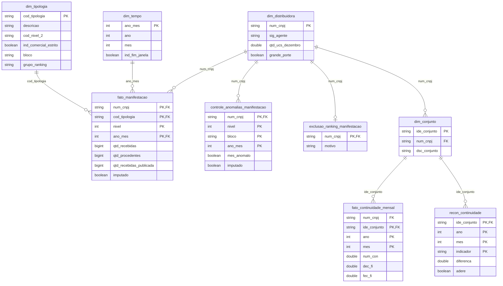
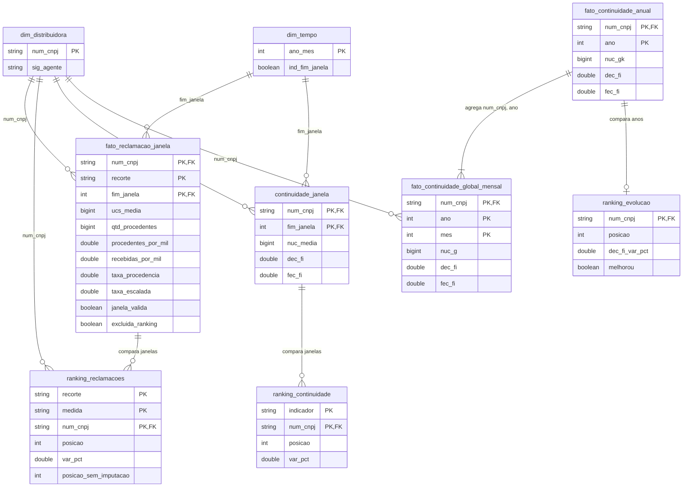

# Modelo de dados

Catálogo `mvp_aneel` no Unity Catalog (serviço do Databricks que guarda tabelas, permissões e descrições). A lista completa de colunas, com tipo e descrição, está no catálogo de dados.

**Esquema adotado: constelação de fatos** (vários fatos que compartilham as mesmas dimensões). Reclamações e continuidade têm fatos próprios e se encontram na `dim_distribuidora`, dimensão conformada (a mesma tabela, com o mesmo significado, servindo a mais de um fato). É ela que permite pôr lado a lado a posição de cada distribuidora nos dois temas.

## Silver: dimensões conformadas e fatos no grão da fonte

**Como ler.** Cada caixa é uma tabela. A linha liga a dimensão (lado "um") ao fato (lado "muitos"). PK é a chave primária; FK, a chave que aponta para a dimensão.

| Fato | Grão (o que uma linha representa) |
|---|---|
| `fato_manifestacao` | reclamações de uma distribuidora, em uma tipologia, um nível de atendimento e um mês |
| `fato_continuidade_mensal` | indicadores de um conjunto de unidades consumidoras em um mês |

**Fatos normalizados.** Os fatos seguem a 3FN (terceira forma normal: cada coluna depende só da chave inteira, sem descrições repetidas). O fato guarda códigos e quantidades; nomes e descrições ficam nas dimensões. Duas exceções são deliberadas:

- `num_cnpj` na `fato_continuidade_mensal` repete o que a `dim_conjunto` já informa. Poupa uma junção em toda consulta por distribuidora.
- `dec`, `fec`, `dec_fi` e `fec_fi` são somas das parcelas da própria linha. Ficam gravados para que a regra de composição exista em um único lugar.

`qtd_*` e `qtd_*_publicada` não são redundância: são dois fatos distintos, o valor usado após a imputação e o valor publicado pela ANEEL, mantidos lado a lado para auditoria.

**Dimensões desnormalizadas (esquema estrela).** A `dim_tipologia` achata em colunas a hierarquia de três níveis da REH 2.992/2021 (família, grupo, tipologia). Filtrar "Faturamento" não exige percorrer a árvore. O custo, repetir a descrição do nível superior em cada linha, é pequeno numa tabela curta e estável.

**Floco de neve pontual** (dimensão que aponta para outra dimensão). A `dim_conjunto` referencia a `dim_distribuidora` em vez de repetir seus atributos. Fica normalizada porque só a continuidade usa conjunto.

**Tabelas de controle.** `controle_anomalias_manifestacao`, `exclusao_ranking_manifestacao` e `recon_continuidade` não são fatos de análise. Registram as decisões de qualidade (meses imputados, distribuidoras excluídas, conferência com o DEC e o FEC publicados), para que cada correção seja rastreável.

## Gold: métricas em janelas móveis e rankings

**Como ler.** A Gold é feita para consulta e é desnormalizada de propósito: cada tabela já traz o indicador calculado, e os rankings repetem os valores de início e fim ao lado da posição. Nada na Gold é dado novo; tudo se recalcula a partir da Silver.

| Tabela | Grão |
|---|---|
| `fato_reclamacao_janela` | distribuidora × recorte × janela de 12 meses |
| `ranking_reclamacoes` | recorte × medida × distribuidora |
| `continuidade_janela` | distribuidora × janela de 12 meses |
| `ranking_continuidade` | indicador × distribuidora |
| `fato_continuidade_global_mensal` | distribuidora × mês |
| `fato_continuidade_anual` | distribuidora × ano civil |
| `ranking_evolucao` | distribuidora |

## Onde o modelo se afasta da referência do curso

- **Chaves naturais em vez de chaves substitutas** (surrogate: número sequencial sem significado de negócio). CNPJ, código da tipologia e AAAAMM são estáveis na fonte, e não há histórico de atributo a versionar. A chave natural permite conferir qualquer linha direto contra o arquivo da ANEEL.
- **Integridade garantida por teste, não por restrição.** No Unity Catalog, PRIMARY KEY e FOREIGN KEY são apenas informativas e não bloqueiam carga. Unicidade de chave e ausência de órfãos (linha do fato sem correspondente na dimensão) são verificadas nos testes ao fim de cada notebook.
- **`dim_tempo` não é conformada.** Cobre só o período das reclamações (jan/2024 a jun/2026); a continuidade usa `ano` e `mes` próprios. Melhoria: estender a `dim_tempo` à série de continuidade e adotar `ano_mes` nos dois fatos.

## O que mudou no caminho

| Data | Mudança | Motivo |
|---|---|---|
| 21/09 | `dim_distribuidora` sai da Silver de continuidade e vira dimensão conformada, em notebook próprio | Evita dependência escondida entre etapas e uma dimensão por fonte |
| 23/09 | Escopo reduzido de seis métricas para o ranking de reclamações | Prazo; a continuidade ficou como validação |
| 23/09 | Forma de contato sai do grão da `fato_manifestacao` | Nenhuma pergunta de negócio a usa; só inflava o volume |
| 24/09 | Município sai do grão e a `dim_municipio` deixa de existir | Nenhuma pergunta de negócio usa município |
